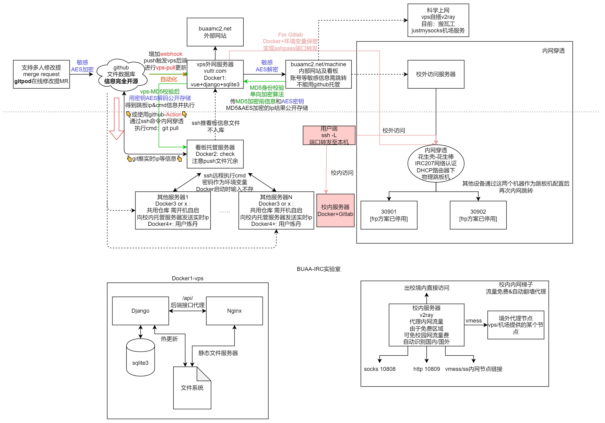

# IRC-Website4.0 : django版&git+docker部署
[IRC计算架构标准化方案](https://j1gkjgppjx.feishu.cn/docs/doccnjgyQDdhwphXpcSsWYi6Grh)


# 0.gitpod
[Gitpod.io](https://www.gitpod.io) 是一个免费的在线开发环境，你也可以使用它参与本项目，方便快速编辑和提交。

<a href="https://gitpod.io/#https://github.com/Archer-Tatsu/MC-2" target="_blank" alt="Open in Gitpod"></a>


# 1.服务器部署
## version
1.0 纯静态文件  
2.0 express-nodejs版  
3.0 django+nginx+sqlite3  
4.0(*) git+docker+nginx+django+sqlite3  

## 使用git+docker配置部署:
首先安装docker和docker-compose 可直接apt安装
```
apt install docker
apt install docker.io
apt install docker-compose
mkdir /var/www/upload
chmod -R 777 /var/www/upload #用来接收校内的看板信息

```
项目部署
```
git pull origin master
cd docker
. env.sh
build

start
```
日志文件位于docker/log/django.log中  
后续更新时,直接git pull更新即可，不需要手动传新文件


# 2. 更新修改数据

1) members相关为纯静态页面，对应改html文件代码即可，包括修改照片等信息

2) 网站论文及发表内容均通过sqlite3数据库文件修改，可以参考根目录下的操作视频，使用DBMS软件可视化操作

3) git提交, merge后通过webhook通知后端自动pull&reload。

# 3. IRC内部网站建设
## version
### v1.0 vue+nginx加账号密码版
### v2.0 在线文档版  
### v3.0(*) 共存+AES加密
在线文档经常被封，而之前的nginx加密但是源内容在github开源，依然不安全。而且不方便多人修改，于是采用与主站同端口，利用nginx反代提供前端，对加密信息进行AES处理后保存，后端增加AES加解密接口，且ip运维直接提交MR即可，增加webhook网站自动拉取更新。

# 4 看板docker配置及更新
```
# 只需任意配置一台校内机器跑IRCmachinedocker即可
cd machine/IRCmachinedocker

# 配置运行
. env.sh user password # 使用所有机器共有的账号，特例见code/p2pinfo.py
# 如果ip有变动，修改code/p2pinfo.py, 修改后git push  机器端git pull 再docker restart即可

# 如果没有镜像则进行编译，后续修改代码不需要重新编译
build

# 启动
start
```
最终效果  
http://buaamc2.net/machine/IRCmachinedocker/code/all_external.html

# gitlab+forward
vps端启动docker时
```
cd docer/
. env.sh gitlabip passwd jump_ip jump_port #顺序输入
docker-compose up -d
```
如何配置及使用等信息见gitlab文件夹


# nginx管理网站
采用module方式管理，部署于81端口
```
#添加子模块
git submodule add -b master git@github.com:ywz978020607/docker_nginx_with_manage.git upload_docker
#子模块初始化&下载
git submodule update --init --recursive
#子模块更新
git submodule update --remote
```