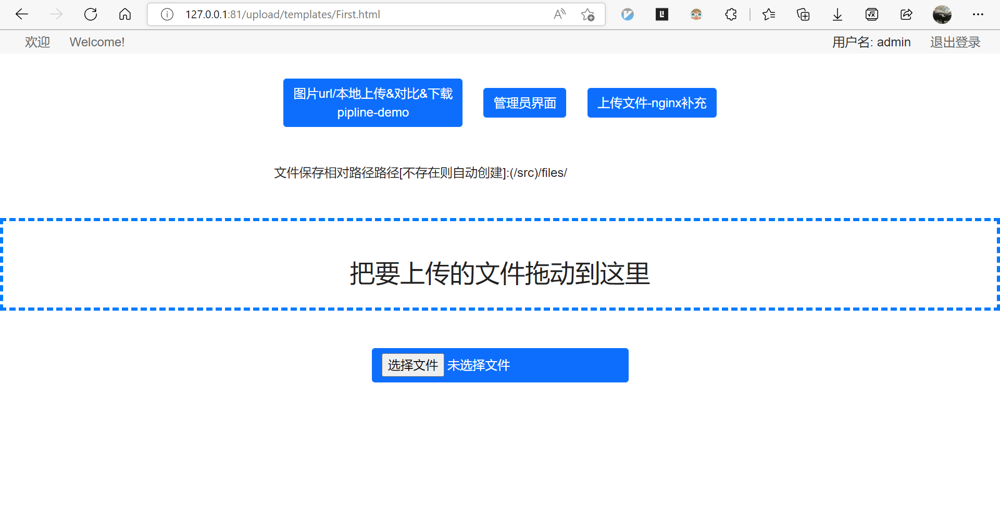
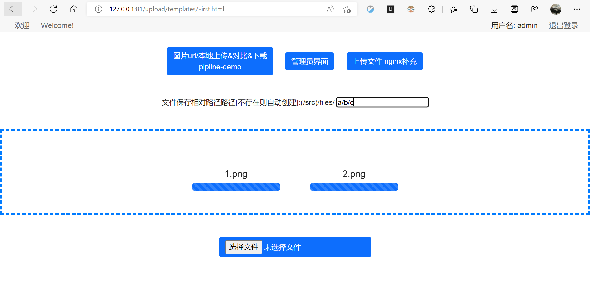

# Docker of nginx with django to support auth, upload(drag or click) and pic_pipeline.
It's a simple nginx docker with a django backend as the background management module to support user auth and upload files/folder, etc. You can loggin as admin with this account.(user:admin   passwd:a)

# Why use this?

If you want to start a nginx with upload by login and user control, you can use this folder as docker to start by one command.

# How to use?
```
chmod +x dev_start.sh
cd docker/
# only once
docker-compose build

docker-compose up -d  #you can change the .yml=> xxx:/src/files path and rerun this command
```
Finally open the page by http://yourip:81/files/ to check the files folder, and open http://yourip:81/upload/templates/Login.html (or `First.html`) to login or upload(automatically jump to login). The django log file is at `docker/log/django.log`.

# Examples
When you start this docker, then you will get this effect:
<center class="half">







</center>

## Note
If the file is too large, then will echo 413 error for nginx/django.conf: `client_max_body_size    5120m;` #you can change this value