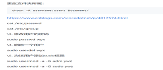
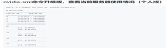
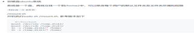
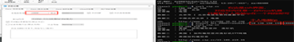

# 脚本工具百宝箱
$$以markdown方式，方便修改提MR到github$$

## 1. 重点内容

## 2. 所有集合

| 显卡功耗限制                                                 |                                                              | [https://nachifur.blog.csdn.net/article/details/120336516?spm=1001.2101.3001.6650.1&utm_medium=distribute.pc_relevant.none-task-blog-2%7Edefault%7ECTRLIST%7ERate-1.pc_relevant_default&depth_1-utm_source=distribute.pc_relevant.none-task-blog-2%7Edefault%7ECTRLIST%7ERate-1.pc_relevant_default&utm_relevant_index=2](https://nachifur.blog.csdn.net/article/details/120336516?spm=1001.2101.3001.6650.1&utm_medium=distribute.pc_relevant.none-task-blog-2~default~CTRLIST~Rate-1.pc_relevant_default&depth_1-utm_source=distribute.pc_relevant.none-task-blog-2~default~CTRLIST~Rate-1.pc_relevant_default&utm_relevant_index=2) |                                                              |
| ------------------------------------------------------------ | ------------------------------------------------------------ | ------------------------------------------------------------ | ------------------------------------------------------------ |
| 监控显卡、空闲后邮件通知                                     | [#   空闲阈值/G 接收邮箱 显卡号(all)   可选追加通知信息      python watch_alert.py 4.5 ywzsunny@buaa.edu.cn all xxxx      (微信中关注qq邮箱公众号可开启微信提醒)](mailto:ywzsunny@buaa.edu.cn) | [https://github.com/ywz978020607/History/tree/master/cv%E7%A0%94%E7%A9%B6%E7%94%9F%E6%97%A5%E5%B8%B8Lab/%E6%9B%B4%E6%96%B0%E6%9C%8D%E5%8A%A1%E5%99%A8%E7%94%A8%E6%88%B7%E5%8D%A0%E7%94%A8%E6%83%85%E5%86%B5](https://github.com/ywz978020607/History/tree/master/cv研究生日常Lab/更新服务器用户占用情况) |                                                              |
| 任意命令结束邮件通知                                         | [#可嵌入任何脚本结束 追加脚本名(非同级可用绝对路径)、邮箱、追加信息(可选)      # eg: [xxx(你的脚本) \] && python   /xxxx/watch_alert.py xxxx@qq.com xxxx](mailto:xxxx@qq.com) | 同上                                                         |  |
| 显卡驱动版本-pytorch                                         | https://www.html.cn/script/python/141467.html                | https://pytorch.org/get-started/previous-versions/           |                                                              |
| 校内linux免装v2ray临时/永久配置流量代理     可搭配个人电脑的v2ray(win)使用 |  | https://blog.csdn.net/dieju8330/article/details/86445698     |                                                              |
| 显示天气预报（可加入.profile每次打开终端显示）               |  | [命令：      curl http://wttr.in](http://wttr.in/)           |                                                              |
| 显卡风扇转速限制（本地设置）                                 | 本地图形界面 将显示器接在显卡上，进入NVIDIA X  server settings可以修改 |  |                                                              |
| 显卡风扇转速限制（远程设置）                                 | nvidia-settings -a  "[gpu:0]/GPUFanControlState=1" -a  "[fan:0]/GPUTargetFanSpeed=99" | 如果nvidia-settings报错，连接不上，可参考右侧链接            | [Linux 上で NVIDIA の GPU のファンをコントロールする –   philo式 (philosy.com)](https://philosy.com/blog/2017/12/12/linux-上で-nvidia-の-gpu-のファンをコントロールする/) |
| python动态传参封装-代码参考                                  | 有别于每次修改conf文件/设定冗长的parser引入/sys.argv[]严格顺序，改用默认字典自动传参引入，见代码 | [https://github.com/ywz978020607/History/tree/master/cv%E7%A0%94%E7%A9%B6%E7%94%9F%E6%97%A5%E5%B8%B8Lab/%E5%B0%81%E8%A3%85%E5%BC%8F%E5%8A%A8%E6%80%81%E4%BC%A0%E5%8F%82](https://github.com/ywz978020607/History/tree/master/cv研究生日常Lab/封装式动态传参) |                                                              |
| 显示本地真实路径                                             | pwd -P                                                       |  |                                                              |
| 查看sudo权限使用记录                                         | cat /var/log/auth.log                                        |                                                              |                                                              |
| docker使用                                                   | 改造进行中，文档已齐全，大家可以随时构建自己的镜像           | [https://github.com/ywz978020607/History/tree/master/cv%E7%A0%94%E7%A9%B6%E7%94%9F%E6%97%A5%E5%B8%B8Lab/mydocker](https://github.com/ywz978020607/History/tree/master/cv研究生日常Lab/mydocker) |                                                              |
| nfs配置使用                                                  | 1server 对 multi clients                                     | [https://github.com/ywz978020607/History/tree/master/cv%E7%A0%94%E7%A9%B6%E7%94%9F%E6%97%A5%E5%B8%B8Lab/nfs%E7%BD%91%E7%BB%9C%E5%85%B1%E4%BA%AB%E9%85%8D%E7%BD%AE](https://github.com/ywz978020607/History/tree/master/cv研究生日常Lab/nfs网络共享配置) |                                                              |
| 显卡占用情况集中看板-docker                                  | 一台校内机器运行即可，注意首次连接ssh gen key                | https://github.com/Archer-Tatsu/MC-2/tree/master/machine/IRCmachinedocker |                                                              |
| 测速                                                         | iperf3                                                       | [https://github.com/ywz978020607/History/blob/master/cv%E7%A0%94%E7%A9%B6%E7%94%9F%E6%97%A5%E5%B8%B8Lab/nfs%E7%BD%91%E7%BB%9C%E5%85%B1%E4%BA%AB%E9%85%8D%E7%BD%AE/ip%E6%B5%8B%E9%80%9F.md](https://github.com/ywz978020607/History/blob/master/cv研究生日常Lab/nfs网络共享配置/ip测速.md) |                                                              |
| ssh密钥登录&别名代替ip地址&vscode                            | 见右边的文件，config可以直接改用户名和路径复制到自己的电脑上 | [https://bhpan.buaa.edu.cn:443/link/0B6AA4CA30F04FA1EB04C23FB2FF0E79      有效期限：2025-02-01 23:59      访问密码：gJoX](https://bhpan.buaa.edu.cn/link/0B6AA4CA30F04FA1EB04C23FB2FF0E79有效期限：2025-02-01 23:59访问密码：gJoX) |                                                              |
| ssh文件系统sshfs                                             | sshfs name@10.x.x.x:/remote/path  /local/path (Linux) \\sshfs\name@10.x.x.x\remote\path \local\path (Win) | https://zhuanlan.zhihu.com/p/314245985                       | 需要手动安装：sudo apt install sshfs,  相比nfs优点是挂载无需sudo,且无需配置分享路径，可以使用该用户可访问的任何路径 |
| png图片转gif图(支持透明通道-透明的png转透明的gif)            | python convertgit.py                                         | [https://github.com/ywz978020607/History/blob/81d31277998172ed588cf611b3147fc3c5bba215/%E6%97%A5%E5%B8%B8%E8%87%AA%E5%8A%A8%E5%8C%96%E5%B7%A5%E5%85%B7/convergif.py](https://github.com/ywz978020607/History/blob/81d31277998172ed588cf611b3147fc3c5bba215/日常自动化工具/convergif.py) |                                                              |